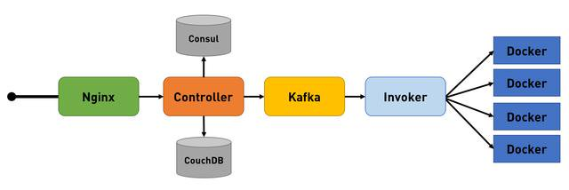
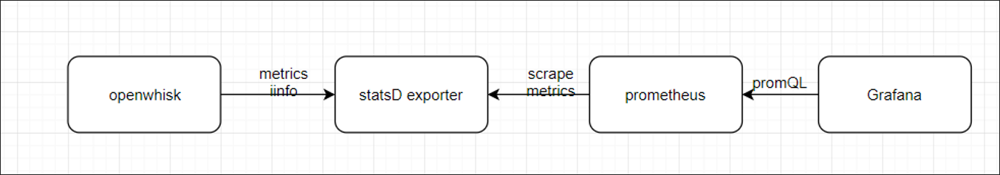
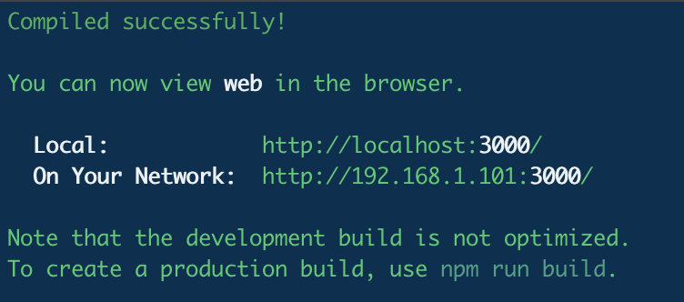

# Project Name: Function as a Service  

## 1.   Vision and Goals Of The Project:

The goals of our project can be summarized as two parts: <br>
* Firstly, we want to build an application whose scenario can leverage the strength of FaaS. For this app, we wish to simulate a driver - passenger system. Passengers will send request to call for a taxi, and drivers will pair with passengers and pick passengers up to the destination.  <br>
* Secondly, we also want to see the performance of Openwhisk and FaaS when it exercises with dynamic amounts of load. We want o to use the simulation as a tool, to analyze and benchmark the performance of Openwhisk. More specifically, we want to observe and benchmark how Openwhisk distribute load when there are huge amount of requests, and the amount of the requests are changing rapidly. <br>


** **
## 2. Users/Personas Of The Project:

The final application will be used by either passengers or drivers. The running system, especially the computational part which using FaaS service, would be further evaluated by researcher. <br><br>
Application End User: <br>
* Passengers: Passengers can see a real time hot spot map that shows the distribution of drivers and other passengers. If it is not likely to hail a taxi for their current location, the application will suggest them a better location. <br>
* Drivers: Most functions are same with the passengers’ side, but considering higher movement flexibility comparing with passengers, the suggesting algorithm would be different for drivers. <br><br>

System Researcher: <br>
* We will start from using historical knowledge, which would give us high freedom to simulate some extreme conditions that maximize the performance of FaaS when testing the application, the system researchers can use it to further benchmark and analyze the characteristics of FaaS platform. <br>    

** **

## 3.   Scope and Features Of The Project:

### Project Outline

This project has achieved three targets:

1. Deploy Openwhisk on minikube locally and Kubernetes on GCP

2. Build an application aimed for taxi driver passenger system

3. Design a benchmarking metrics for Openwhisk

### Openwhisk

Openwhisk description

Apache OpenWhisk (Incubating) is an open source, distributed Serverless platform that executes functions (fx) in response to events at any scale. OpenWhisk manages the infrastructure, servers and scaling using Docker containers so you can focus on building amazing and efficient applications. 

OpenWhisk has integrated several components like Nginx, Kafka, controller and etc to help us coordinate the function call and assign it to any available worker (e.g. Containers). Most of our app will be taken care by OpenWhisk platform.

<div align="center">

</div>


### Application - Frontend

For frontend, we build a web to visualized our application.

#### Framwork

We use React and Redux to build the website.

<div align="center">

</div>

#### Features

Passengers can input their locations in the website and query surrounding drivers. Website will send post request to the backend and get locations from backend. Redux is used to store all these data. Then these locations will be rendered in the web page. Every two seconds, the web page will send request again and update locations.

#### Goal

The website is used to visualize our application and validate our backend functions. The change of data in our database will be displayed directly in our website.

<div align="center">

</div>

<div align="center">

</div>

### Application - Backend

For the simulation part, the application would provid a web application for monitoring positions of drivers and passengers, and also save driver/passenger information on Redis.

### Metrics

The second part is the benchmark for Openwhisk. 

#### How to evaluate the application & OpenWhisk platform?  
* Evaluate the avg. latency from a user perspective  
* Evaluate the computational elasticity of OpenWhisk  

#### What we’ve accomplished:
* A metrics dashboard: The project will monitor and analyze the metrics of Openwhisk. Including the activation count, cold start count for invokers/controllers, and the latency test result.  

This an overview of the metrics system.

<div align="center">

</div>

We first enable OpenWhisk Metrics Support, then used Prometheus to scrape the metrics data, at last, we used Grafana to present a metrics graph  


* A monitoring program: For the benchmark part, Metrics of Openwhisk will be presented and analyzed. Especially when multiple programs are running and sending requests to Openwhisk.  


#### An Example of Metrics

Below is an example of the results of Monitoring metrics

<div align="center">

</div>

The bottom part is the latency monitoring. The latency is measured by using a simple Java program sending request to Openwhisk, and measure the time between sending the request and receiving the response.  
While the above part measures the activation start time for both invoker -- which indicates the work load on the two invokers.


#### Analysis on Metrics

From the result of the benchmark test, there are lots of details and properties of Openwhisk can be observed. Below is one running example we achieved when running two programs and one latency test.

<div align="center">

</div>

From the figure, we can see clearly of the start time and end time for the two programs, and this is one proof that Openwhisk is capable of distributing work on two invokers.

Furthermore, we can see that the latency test program (shown with arrow in the figure) migrates between two invokers during the process. When invoker 1 has a program to run on, the latency test program is automatically switched to invoker 2, and when program 1 ends before program 2, the latency test program goes back to invoker 1.


** **

## 4. Running Instructions

We provide here the instructions to run the program.

### Website

The website is developed in React framework. To run the website in local machine, firstly, [npm](https://www.npmjs.com/get-npm) is a necessary dependency.

#### Install Npm

##### For Linux:

```
$ sudo apt-get update
$ sudo apt-get install nodejs
$ sudo apt-get install npm
```

##### For Mac:

```
$ brew insatll  node
```

##### For Windows:

There is no automatic install tool for windows, you need to go to the [website](https://nodejs.org/en/download/) to download the package and install manually.

##### Check whether you have node and npm installed

To check if you have Node.js installed, run this command in your terminal:

```
$ node -v
```

To confirm that you have npm installed you can run this command in your terminal:
```
$ npm -v
```

#### Install package

Go to the /demo/web directory, install the dependencies.

```
npm install
```

#### Run

After installing all dependencies, you can use simple command to run the website and it will automatically open a webiste.

```
npm run
```

If you see the instrution below, you've successfully run the website on localhost:3000.

<div align="center">

</div>

 ** **

## 5. Acceptance criteria

This FaaS application could:  
1. Build a simulation applicatoin for driver-passenger system: store and present real-time taxi trip data on websites or mobile application.  
2. Set up a mechanism to benchmark Openwhisk: to monitor and analyze performance of Openwhisk when multiple requests are made.


 ** **

## 6.  Release Planning:

Sprint 1 (Due to 2.14):  
1. Familarize with Openwhisk and Serverless Computing
2. Deploy OpenWhisk on Minikube on Mac/Linux 
3. Provide a demo to test the OpenWhisk.  

Sprint 2 (Due to 2.28):  
1. implement our first feature: store data from resources to DB.  
2. implement a front-end to present data stored in DB.  

Sprint 3(Due to 3.21):  
1. implement a simulation program to mimic the behaviors of taxi drivers and customers.  
2. implement a frontend web application to show the locations of drivers and passengers.
3. Benchmark monitoring for local distrubtion of Openwhisk on minikube
4. Set up Openwhisk on Google Cloud Platform(GCP)

Sprint 4(Due to 4.04):  
1. Set up all previous demo/programs on GCP
2. Benchmark the performance of GCP using single invoker
3. Update simulation of passenger and drivers

Sprint 5(Due to 4.18):  
1. Set up two invokers on GCP  
2. Implement Latency test.
3. Monitor and analyze metrics of multiple programs sending requests to GCP  


---
Mentors:
- Tommy Unger
- Tsz Yan Lam

---
Team Members:
- Zhuyu Li
- Yuhang Miao
- Yuxuan Su
- Lian Duan
