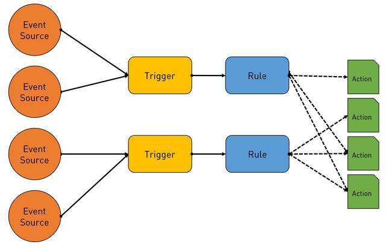
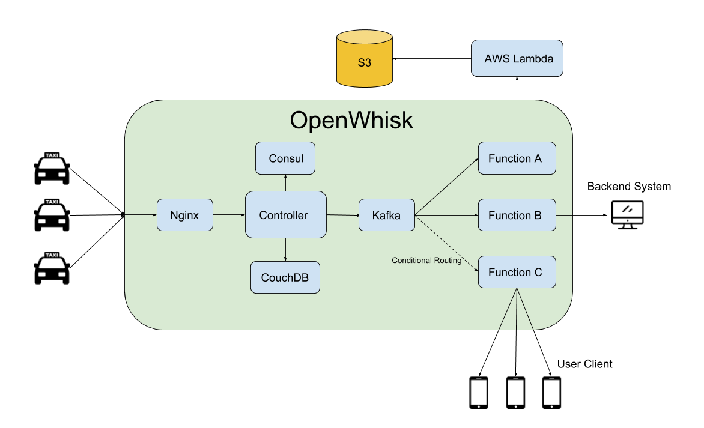
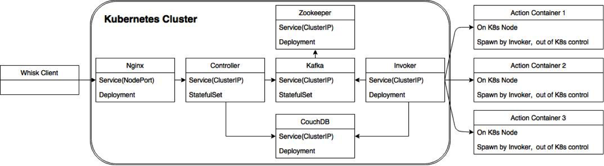

# Project Name: Function as a Service  

## 1.   Vision and Goals Of The Project:

The goals of our project can be summarized as two parts:  
* Firstly, we want to build a mobile application whose scenario can leverage the strength of FaaS. For this app, the computing requirement for OpenWhisk is dynamic and may have high variance for a very short time.  
* Secondly, we also want to see the performance of FaaS when it exercises with dynamic amounts of load. We may also go deep into the OpenWhisk’s source code to evaluate the benchmark of the system. 

Our final product would be an application that assists taxi taking process, it receives real time data of drivers and passengers. Considering some regular events such as rush hour, and some sudden events such as a heavy rain or the end of an activity for a specific area, all those conditions will lead to a significant variance of the taxi requirement. Therefore, the scenario is obviously suitable for FaaS.  

The functions covered by application can be divided into two layers:  
* The application will directly read the location data of passengers and drivers and provide users a hot spot map to directly show the distribution.  
* The application will recommend the location that is most likely to make a deal for both passengers and drivers, that would be a trade-off between distance and probability.  

** **
## 2. Users/Personas Of The Project:

The final application will be used by either passengers or drivers. The running system, especially the computational part which using FaaS service, would be further evaluated by researcher.   
Application End User:  
* Passengers: Passengers can see a real time hot spot map that shows the distribution of drivers and other passengers. If it is not likely to hail a taxi for their current location, the application will suggest them a better location.  
* Drivers: Most functions are same with the passengers’ side, but considering higher movement flexibility comparing with passengers, the suggesting algorithm would be different for drivers.   

System Researcher:  
* We will start from using historical knowledge, which would give us high freedom to simulate some extreme conditions that maximize the performance of FaaS when testing the application, the system researchers can use it to further evaluate the characteristics of FaaS platform.      

** **

## 3.   Scope and Features Of The Project:

The project aims to implement FaaS for taxi data analysis, which includes taxi route real time capture, taxi routes density analysis, passenger population flow map, and taxi driver route recommendation upon emergency or sudden events. In summary, the FaaS would serve as a tool to give thorough real time analysis on taxi running status, and to give special recommendations during emergency or abrupt events.  
The project contains 3 stages:  
* 1st Stage: implement FaaS for taxi driver static data. In this stage, the FaaS would deal with historical chunk of taxi data. The data would include basic information including passenger pick up position, passenger drop off position position, pick up time, drop off time etc. Based on these data, a taxi flow heat map will be generated. Furthermore, the population flow of different time and location would also be shown.  
* 2nd Stage: In this stage, the FaaS would deal with real time data. Each taxi’s real time information will be collected and analyzed by the service. In this stage high throughput real time data would be monitored and analyzed, taking the advantage of cloud platform.  
* 3rd Stage: To fully utilize the characteristics of FaaS, huge data size changes in the data stream will be considered. In this stage, sudden changes in the taxi-passenger system is considered. Two example features would be implemented. 1, When there is a sudden event happening at a certain spot, i.e a concert or game. During this time all the passengers would be traveling from one place to another specific place. 2, When there is a huge rain, a huge amount of passengers would emerge asking for taxis. During these events, a sudden change in the data stream would occur, and the FaaS would deal with these circumstances: make recommendations locations to drivers, and even allocate different drivers to certain areas to meet the demand.  

** **

## 4. Solution Concept

In real world, incoming requests from taxis will change rapidly. The server needs to be elastic so it can take quick responses to those changes, which means the server should have the ability to scale up in a short time. FaaS is a suitable solution for this situation. Rather than in system level or application level, the service will be scalable in the function level, which costs less and is much easier to start up and destroy. There are some mature FaaS platform now, like AWS Lambda, Azure Functions, Google Cloud Function and IBM OpenWhisk. Here we choose to use IBM OpenWhisk platform.

Apache OpenWhisk (Incubating) is an open source, distributed Serverless platform that executes functions (fx) in response to events at any scale. OpenWhisk manages the infrastructure, servers and scaling using Docker containers so you can focus on building amazing and efficient applications. 

OpenWhisk has integrated several components like Nginx, Kafka, controller and etc to help us coordinate the function call and assign it to any available worker (e.g. Containers). Most of our app will be taken care by OpenWhisk platform.

Based on OpenWhisk platform, our application will take requests from different clients and take different actions pointing to every requests. Those data will be firstly stored into the database to update the instant location of every taxi, and then sent to the cloud to be stored for data analyse. We will also design a backend system to read location data from database and send these informations to our backend system and users.

Kubernetes is a well-known container orchestration tool, which can be used to deploy container-native applications. Here we’ll deploy OpenWhisk over Kubernetes, which can leverage the capabilities provided by Kubernetes to better control and manage OpenWhisk containers, which can result in a stable OpenWhisk runtime. 

Helm is a tool for managing Kubernetes charts, while charts are packages of pre-configured Kubernetes resources. By using Helm,we can write charts, which are in template format, to define a set of Kubernetes resources (each resource stands for a component of your application), and use Helm to deploy the charts over a Kubernetes cluster.

 ** **

## 5. Acceptance criteria

This FaaS application could:  
1. Store and present real-time taxi trip data on websites or mobile application.  
2. Show how many trips passed through georect defined by two latitude/longitude points.  
3. Show how many trips were occurring at a given point in time.  
4. Show how many trips started or stopped within a georect, and the sum total of their fares.  
5. Pair the customers and drivers for a trip.  

 ** **

## 6.  Release Planning:

Iteration1(Due to 2.14):  
1. set up one-node Kubernetes Cluster on our own computers.  
2. deploy OpenWhisk over Kubernetes.  
3. Automated the installation and deployment of OpenWhisk.  
4. Provide a demo to test the OpenWhisk.  

Iteration2(Due to 2.28):  
1. implement our first feature: store data from resources to DB.  
2. implement a front-end to present data stored in DB.  

Iteration3(Due to 3.21):  
1. implement a program to mimic the behaviors of taxi drivers and customers.  
2. test based on demo2.  
3. explore & develope more features.  

Iteration4(Due to 4.04):  
1. explore & develope more features.  
...  

Iteration5(Due to 4.18):  
1. scale up Kubernetes to multiple nodes.  
2. move service from local computer to public cloud providers.  

---
Mentors:
- Tommy Unger
- Tsz Yan Lam

---
Team Members:
- Zhuyu Li
- Yuhang Miao
- Yuxuan Su
- Lian Duan
