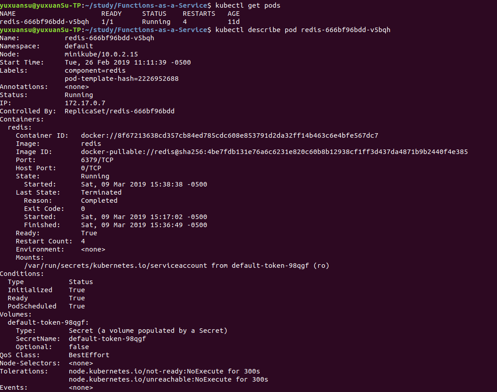
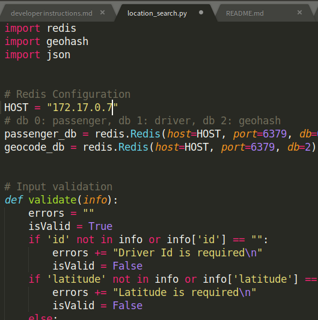
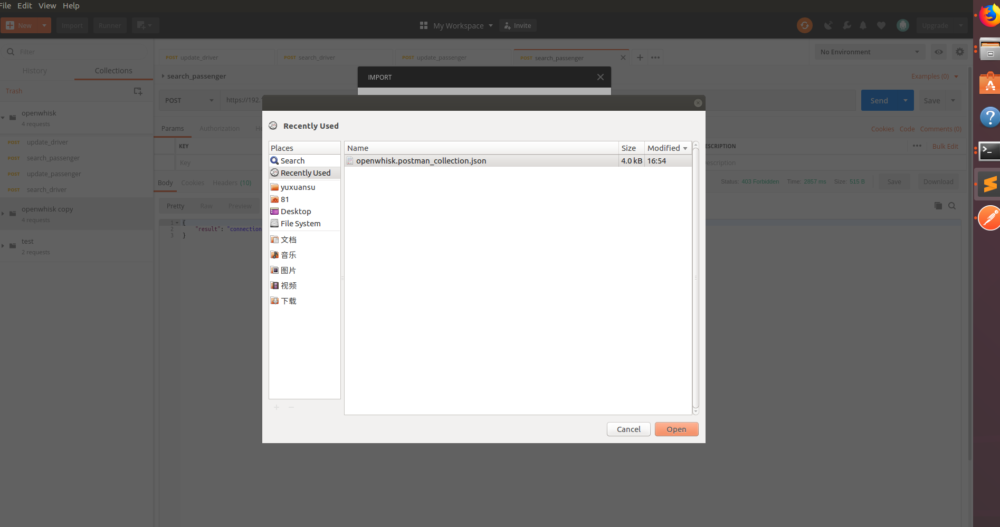
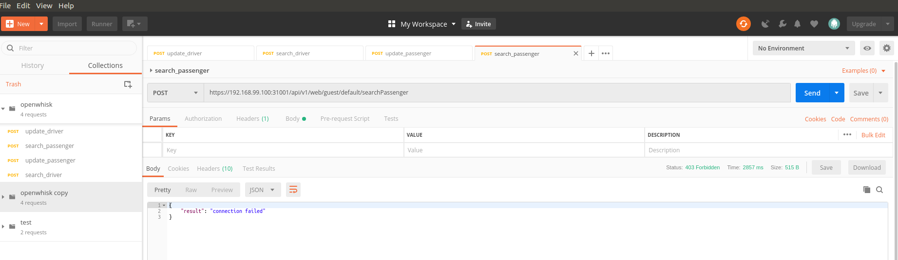

# Developer Instructions
## project structure
```
Function-as-a-Service
│   README.md
│   .gitignore    
│
└───demo	(store demo program)
│      
└───docs	(store all the documentation)
|   └───deploy openwhisk on kubernetes.md
|   |
|	└───developer instructions.md
|		...
└───images	(store all the iamges for documentations)
|
└───openwhisk
|	└───actions 	(store all the actions files deployed on openwhisk)
|	|
|	└───docker		(store all the DockerFile prepared for the functions)
|	|
|	└───scripts		(store all the scriptes file, such as install Openwhisk or start OpenWhisk...)
|	|
|	└───test		(store the test files)
|
└───presentations	(store all the slides for presentation)
|
└───simulation		(all the code of simulation program)
``` 

## how to set up demo2

### prerequisite

make sure that you followed the instuction here: https://github.com/apache/incubator-openwhisk-deploy-kube and successfully install Opnewhisk on minikube.  
Also make sure the you set up `wsk`.  

### Step 1.
Actually, once you set up OpenWhisk, every time you start minikube, the OpenWhisk will start running automatically. So you don't have to reinstall it.  
You can use the `openwhisk/scripts/start_OW.sh` to start the minikube and set up ssh.

### Step 2.
if you haven't deploy redis on minikube, you can use `openwhisk/scripts/deploy_redis.sh` to set up a redis pod.  
To check the Redis pod's status, you can use:  
```
kubectl get pods
```
and wait until it's running.  


In order to connect to the Redis node, you have to check the redis pod's ip, and change HOST variable in all the py file in `openwhisk/actions/drivers/` and `openwhisk/actions/passengers/`  
check the ip:  
  
change the HOST variable:  


### Step 3.
Go to `openwhisk/scripts/` and use the .sh file to create all the actions on OpenWhisk:  
```
chmod +x actions_create.sh
./actions_create.sh
```


the url of each actions will be printed.  
to view all the actions, you can call `wsk action list`  


To delete the actions you created:  
```
chmod +x actions_delete.sh
./actions_delete.sh
```   

### Step 4.
To test the actions you create, you can use postman(https://www.getpostman.com/) to send HTTP request and test.  
You can import the .json file in the `openwhisk/test/` folders and use them to test  
Go to the file->import... of the postman and import the json file:  

  


## using git to contribute codes

