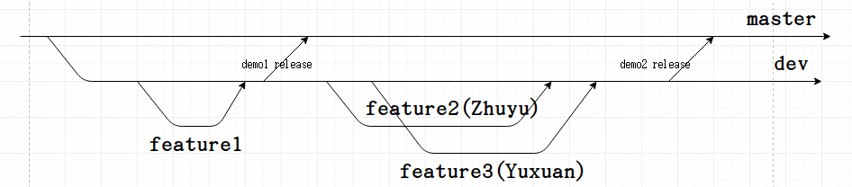

# Developer Instructions
## project structure
```
Function-as-a-Service
│   README.md
│   .gitignore    
│
└───demo	(store demo program)
│      
└───docs	(store all the documentation)
|   └───deploy openwhisk on kubernetes.md
|   |
|	└───developer instructions.md
|		...
└───images	(store all the iamges for documentations)
|
└───openwhisk
|	└───actions 	(store all the actions files deployed on openwhisk)
|	|
|	└───docker		(store all the DockerFile prepared for the functions)
|	|
|	└───scripts		(store all the scriptes file, such as install Openwhisk or start OpenWhisk...)
|	|
|	└───test		(store the test files)
|
└───presentations	(store all the slides for presentation)
|
└───simulation		(all the code of simulation program)
``` 

## how to set up demo2

### prerequisite

make sure that you followed the instuction here: https://github.com/apache/incubator-openwhisk-deploy-kube and successfully install Opnewhisk on minikube.  
Also make sure the you set up `wsk`.  

### Step 1.
Actually, once you set up OpenWhisk, every time you start minikube, the OpenWhisk will start running automatically. So you don't have to reinstall it.  
You can use the `openwhisk/scripts/start_OW.sh` to start the minikube and set up ssh.

### Step 2.
if you haven't deploy redis on minikube, you can use `openwhisk/scripts/deploy_redis.sh` to set up a redis pod.  
To check the Redis pod's status, you can use:  
```
kubectl get pods
```
and wait until it's running.  


In order to connect to the Redis node, you have to check the redis pod's ip, and change HOST variable in all the py file in `openwhisk/actions/drivers/` and `openwhisk/actions/passengers/`  
check the ip:  
  
change the HOST variable:  


### Step 3.
Go to `openwhisk/scripts/` and use the .sh file to create all the actions on OpenWhisk:  
```
chmod +x actions_create.sh
./actions_create.sh
```


the url of each actions will be printed.  
to view all the actions, you can call `wsk action list`  


To delete the actions you created:  
```
chmod +x actions_delete.sh
./actions_delete.sh
```   

### Step 4.
To test the actions you create, you can use postman(https://www.getpostman.com/) to send HTTP request and test.  
You can import the .json file in the `openwhisk/test/` folders and use them to test  
Go to the file->import... of the postman and import the json file:  

  


## using git to contribute codes

There are two major braches(dev and master) we used for our development. We mainly develop all the features to dev branch. The master branch is a relatively stable branch. When we release a new version of our program for demo, we will merge all the changes from dev branch to the master branch. When developing, using feature branch is highly recommended. You can checkout a new branch from the dev branch, write some codes and merge them to the dev branch. So the network may looks like this:  
 

For example, I need to implement the feature: Simulation Program Design:
```
# first switch to the dev branch
git checkout dev

# create and switch to a new branch: story73_simulationDesign
# I recommend using the user story number from taiga to represent the feature, it's easier to trace
git checkout -b story73_simulationDesign

# After writing some code about this feature
# you can use this to check what has been changed
git status

# and decide the changes to be saved
git add <your file>
git commit -m "<describe what you did>"

# you can directly save the changes to the story73_simulationDesign branch
git push -u origin story73_simulationDesign

# Or, if you have finished this feature or you just want to update it to the dev branch
# you can merge them to the dev branch
git checkout dev
git merge --no-ff -m "merge from story73_simulationDesign" story73_simulationDesign
git push -u origin dev
```

Sometimes, when you use `git merge` you may find some files in the dev branch is confict to the files in your feature branch. This is because someone is editing the same file. You can work with the teamate to solve this problem. For more detail, you can visit this blog: https://www.liaoxuefeng.com/wiki/0013739516305929606dd18361248578c67b8067c8c017b000/001375840202368c74be33fbd884e71b570f2cc3c0d1dcf000
